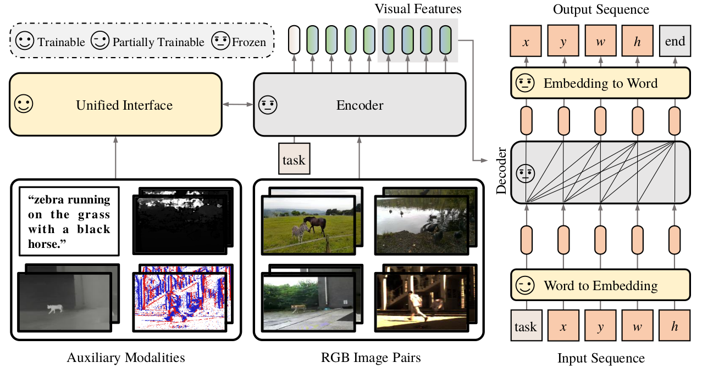

# SeqTrackv2

> [**Unified Sequence-to-Sequence Learning for Single- and Multi-Modal Visual Object Tracking**](https://arxiv.org/abs/2304.14394)<br>
> [Xin Chen](https://scholar.google.com.hk/citations?user=A04HWTIAAAAJ), [Ben Kang](https://scholar.google.com.hk/citations?user=By9F6bwAAAAJ), [Jiawen Zhu](https://scholar.google.com.hk/citations?user=j_gYsS8AAAAJ), [Dong Wang](http://faculty.dlut.edu.cn/wangdongice/zh_CN/index.htm), [Houwen Peng](https://houwenpeng.com/), [Huchuan Lu](https://ice.dlut.edu.cn/lu/)

This is an official pytorch implementation of the paper Unified Sequence-to-Sequence Learning for Single- and Multi-Modal Visual Object Tracking.


## Highlights
### Seq2seq modeling
SeqTrack models tracking as a **sequence generation** task. If the model knows where the target object is, we could simply teach it how to read the bounding box out.


### Simple architecture and loss function
SeqTrack only adopts a **plain encoder-decoder transformer** architecture with a **simple cross-entropy loss**.


### Unified framework for multi-modal tracking
SeqTrackv2 handles four multi-modal tracking tasks with a unified model and parameter set.



### Strong performance
#### Single-Modal Tracking:
| Tracker      | LaSOT (AUC) | GOT-10K (AO) | TrackingNet (AUC) |
|--------------|-------------|--------------|-------------------|
| **SeqTrack** | **72.5**    | **74.8**     | **85.5**          |
| OSTrack      | 71.1        | 73.7         | 83.9              |
| SimTrack     | 70.5        | 69.8         | 83.4              |
| Mixformer    | 70.1        | 70.7         | 83.9              |

#### Multi-Modal Tracking:
| Tracker        | LasHeR (AUC) | RGBT234 (MSR) | VOT-RGBD22 (EAO) | DepthTrack (F-score) | VisEvent (AUC) | TNL2K (AUC) |
|----------------|--------------|---------------|------------------|----------------------|----------------|-------------|
| **SeqTrackv2** | **61.0**     | **68.0**      | **74.8**         | **62.3**             | **63.4**       | **62.4**    |
| ViPT           | 52.5         | 61.7          | 72.1             | 59.4                 | 59.2           | -           |
| Un-Track       | -            | 62.5          | 72.1             | 61.0                 | 58.9           | -           |
| JointNLT       | -            | -             | -                | -                    | -              | 56.9        |

## Install the environment
```
conda create -n seqtrackv2 python=3.8
conda activate seqtrackv2
bash install.sh
```

* Add the project path to environment variables
```
export PYTHONPATH=<absolute_path_of_SeqTrackv2>:$PYTHONPATH
```

## Data Preparation
Put the tracking datasets in [./data](data). It should look like:

For RGB tracking:
   ```
   ${SeqTrack_ROOT}
    -- data
        -- lasot
            |-- airplane
            |-- basketball
            |-- bear
            ...
        -- got10k
            |-- test
            |-- train
            |-- val
        -- coco
            |-- annotations
            |-- images
        -- trackingnet
            |-- TRAIN_0
            |-- TRAIN_1
            ...
            |-- TRAIN_11
            |-- TEST
   ```
For Multi-Modal tracking (RGB-T234 and otb_lang is only for evaluation, thus can be ignored):
   ```
   ${SeqTrack_ROOT}
    -- data
        -- depthtrack
            -- train
                |-- adapter02_indoor
                |-- bag03_indoor
                |-- bag04_indoor
                ...
        -- lasher
            -- trainingset
                |-- 1boygo
                |-- 1handsth
                |-- 1phoneblue
                ...
            -- testingset
                |-- 1blackteacher
                |-- 1boycoming
                |-- 1stcol4thboy
                ...
        -- RGB-T234
            |-- afterrain
            |-- aftertree
            |-- baby
            ...
        -- visevent
            -- train
                |-- 00142_tank_outdoor2
                |-- 00143_tank_outdoor2
                |-- 00144_tank_outdoor2
                ...
            -- test
                |-- 00141_tank_outdoor2
                |-- 00147_tank_outdoor2
                |-- 00197_driving_outdoor3
                ...
            -- annos
        -- tnl2k
            -- train
                |-- Arrow_Video_ZZ04_done
                |-- Assassin_video_1-Done
                |-- Assassin_video_2-Done
                ...
            -- test
                |-- advSamp_Baseball_game_002-Done
                |-- advSamp_Baseball_video_01-Done
                |-- advSamp_Baseball_video_02-Done
                ...
        -- lasot
            |-- airplane
            |-- basketball
            |-- bear
            ...
        -- refcoco
            -- images
                -- train2014
                |-- COCO_train2014_000000291797.jpg
                |-- COCO_train2014_000000581921.jpg
                |-- COCO_train2014_000000291788.jpg
                ...  
            -- refcocog
                |-- instances.json
        -- otb_lang
            -- OTB_videos
                |-- Basketball
                |-- Biker
                |-- Bird1
                ...  
            -- OTB_query_train
                |-- Basketball.txt
                |-- Bolt.txt
                |-- Boy.txt
                ...  
            -- OTB_query_test
                |-- Biker.txt
                |-- Bird1.txt
                |-- Bird2.txt
                ...  
   ```
## Set project paths
Run the following command to set paths for this project
```
python tracking/create_default_local_file.py --workspace_dir . --data_dir ./data --save_dir .
```
After running this command, you can also modify paths by editing these two files
```
lib/train/admin/local.py  # paths about training
lib/test/evaluation/local.py  # paths about testing
```

## Train
### Train SeqTrack
```
python -m torch.distributed.launch --nproc_per_node 8 lib/train/run_training.py --script seqtrack --config seqtrack_b256 --save_dir .
```
(Optionally) Debugging training with a single GPU
```
python tracking/train.py --script seqtrack --config seqtrack_b256 --save_dir . --mode single
```

### Train SeqTrackv2
The pretrained SeqTrack models and Bert models can be downloaded here [[Google Drive]](https://drive.google.com/drive/folders/19nXt1rQVqf6TgpSmvTR_13LvlDPAxk29?usp=sharing)[[Baidu Drive]](https://pan.baidu.com/s/16G2LUiyQNouZ5MJUZeaLYw?pwd=iiau).
Put the pretrained models in [./pretrained](pretrained), it should be like:

   ```
   ${SeqTrack_ROOT}
    -- pretrained
        -- bert
            |-- bert-base-uncased.tar.gz
            |-- bert-base-uncased-vocab.txt
            |-- bert_config.json
            |-- pytorch_model.bin
        -- seqtrack
            -- seqtrack_b256
                |-- SEQTRACK_ep0500.pth.tar
            -- seqtrack_b384
                |-- SEQTRACK_ep0500.pth.tar
            -- seqtrack_l256
                |-- SEQTRACK_ep0500.pth.tar
            -- seqtrack_l384
                |-- SEQTRACK_ep0500.pth.tar
   ```
Then, run the following command:
```
python -m torch.distributed.launch --nproc_per_node 4 lib/train/run_training.py --script seqtrackv2 --config seqtrackv2_b256 --save_dir .
```
(Optionally) Debugging training with a single GPU
```
python tracking/train.py --script seqtrackv2 --config seqtrackv2_b256 --save_dir . --mode single
```


## Test and evaluate on benchmarks
### SeqTrack for RGB-based Tracking
- LaSOT
```
python tracking/test.py seqtrack seqtrack_b256 --dataset lasot --threads 2
python tracking/analysis_results.py # need to modify tracker configs and names
```
- GOT10K-test
```
python tracking/test.py seqtrack seqtrack_b256_got --dataset got10k_test --threads 2
python lib/test/utils/transform_got10k.py --tracker_name seqtrack --cfg_name seqtrack_b256_got
```
- TrackingNet
```
python tracking/test.py seqtrack seqtrack_b256 --dataset trackingnet --threads 2
python lib/test/utils/transform_trackingnet.py --tracker_name seqtrack --cfg_name seqtrack_b256
```
- TNL2K
```
python tracking/test.py seqtrack seqtrack_b256 --dataset tnl2k --threads 2
python tracking/analysis_results.py # need to modify tracker configs and names
```
- UAV123
```
python tracking/test.py seqtrack seqtrack_b256 --dataset uav --threads 2
python tracking/analysis_results.py # need to modify tracker configs and names
```
- NFS
```
python tracking/test.py seqtrack seqtrack_b256 --dataset nfs --threads 2
python tracking/analysis_results.py # need to modify tracker configs and names
```
- VOT2020  
Before evaluating "SeqTrack+AR" on VOT2020, please install some extra packages following [external/AR/README.md](external/AR/README.md)
```
cd external/vot20/<workspace_dir>
export PYTHONPATH=<path to the seqtrack project>:$PYTHONPATH
vot evaluate --workspace . seqtrack_b256_ar
vot analysis --nocache
```
### SeqTrackv2 for Multi-Modal Tracking
- LasHeR
```
python ./RGBT_workspace/test_rgbt_mgpus.py --script_name seqtrackv2 --dataset_name LasHeR --yaml_name seqtrackv2_b256
# Through this command, you can obtain the tracking result. Then, please use the official matlab toolkit to evaluate the result. 
```
- RGBT-234
```
python ./RGBT_workspace/test_rgbt_mgpus.py --script_name seqtrackv2 --dataset_name RGBT234 --yaml_name seqtrackv2_b256
# Through this command, you can obtain the tracking result. Then, please use the official matlab toolkit to evaluate the result. 
```
- VisEvent
```
python ./RGBE_workspace/test_rgbe_mgpus.py --script_name seqtrackv2 --dataset_name VisEvent --yaml_name seqtrackv2_b256
# Through this command, you can obtain the tracking result. Then, please use the official matlab toolkit to evaluate the result. 
```
- TNL2K
```
python tracking/test.py seqtrackv2 seqtrackv2_b256 --dataset tnl2k --threads 0
python tracking/analysis_results.py # need to modify tracker configs and names
```
- OTB99
```
python tracking/test.py seqtrackv2 seqtrackv2_b256 --dataset otb99_lang --threads 0
python tracking/analysis_results.py # need to modify tracker configs and names
```
- DepthTrack
```
cd Depthtrack_workspace
vot evaluate seqtrackv2_b256
vot analysis seqtrackv2_b256 --nocache
```
- VOT-RGBD22
```
cd VOT22RGBD_workspace
vot evaluate seqtrackv2_b256
vot analysis seqtrackv2_b256 --nocache
```

## Model Zoo
The trained models, and the raw tracking results are provided in the [model zoo](MODEL_ZOO.md)


